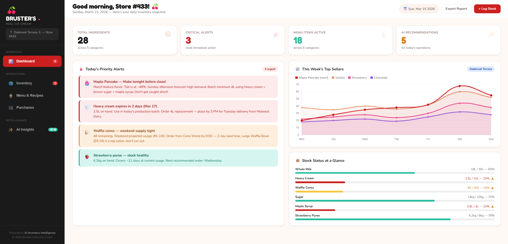

# 🍒 Inventory Intelligence (Store #433)

An interactive, AI-driven inventory management dashboard designed for the **Oakbrook Terrace, IL** Bruster’s Real Ice Cream location. This system tracks ingredient levels, forecasts demand based on seasonal trends, and provides actionable operational insights.

 
## 🚀 Features
* **Real-time Stock Tracking:** Visual progress bars and status badges (Critical/Low/Healthy) for 28+ ingredients.
* **AI Insight Engine:** Simulated machine learning models that suggest batches (e.g., Maple Pancake) and restock priorities based on sales data and weather patterns.
* **Dynamic Menu & Recipes:** Automatic ingredient usage calculation per serving for 18 active menu items.
* **Financial Analysis:** Spend tracking by category (Dairy, Flavors, Packaging) with visual bar charts powered by Chart.js.
* **Priority Alerts:** Automated notification system for expiring dairy and weekend stock risks.

## 🛠️ Tech Stack
* **Frontend:** HTML5, CSS3 (Custom Variables/Flexbox/Grid)
* **Data Visualization:** [Chart.js](https://www.chartjs.org/)
* **Typography:** Google Fonts (Fredoka One, Nunito)
* **Logic:** Vanilla JavaScript (ES6+)

## 📦 Installation & Usage
1.  Clone the repository:
    ```bash
    git clone [https://github.com/yourusername/Brusters-Inventory-Intelligence.git](https://github.com/yourusername/Brusters-Inventory-Intelligence.git)
    ```
2.  Open `src/index.html` in any modern web browser.
3.  No build process or dependencies required (uses CDN for Chart.js).

## 📈 Operational Insights
The system is currently configured for **March 2026** operations, focusing on the "Maple Pancake" feature flavor and managing high-demand weekend spikes.

## 📜 License
This project is for educational/operational management purposes for Real Ice Cream Store #433.
